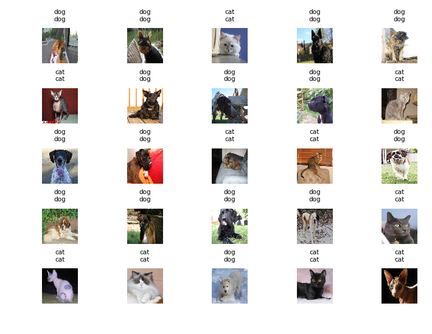
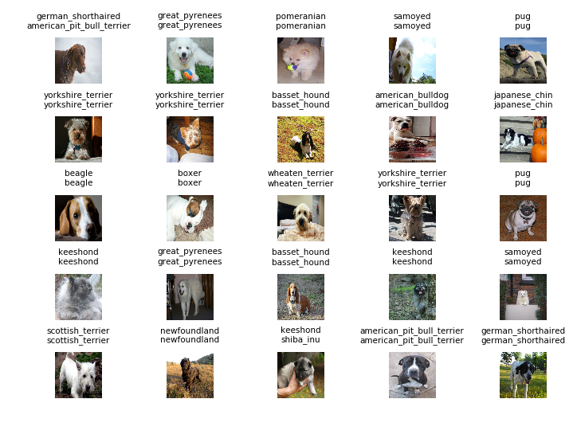
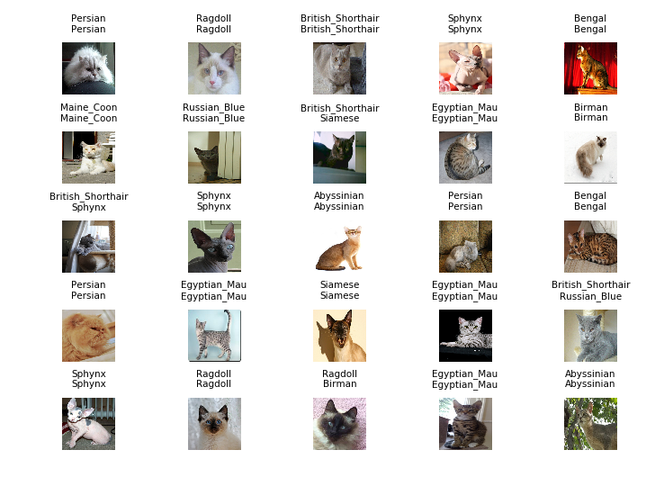

# Animal breed classification
This project uses a modified VGG-16 model on PyTorch to classify animal breeds.

Major task:
 - Sanitize dataset, drop invalid images
 - Create dataset R/W and encoding
 - Create batch image preview
 - Prepare modified VGG-16
 - Train model
 - Hyperparameter fine tuning
 - Predict on unseen test set
 - Memory optimization
 - [In progress] Web app interfaces for image classification

Dataset: https://www.kaggle.com/zippyz/cats-and-dogs-breeds-classification-oxford-datVaset

The project creates 3 classifiers to perform following tasks:
1. cat-dog classification
2. cat breed classification
3. dog breed classification

The overall goal is a 2-stage classification. In stage 1, model 1 decide whether input belongs to cat or dog; depending on the output, we use model 2 or model 3 to detect animal breed. The web application uses PHP backend and calls python daemon for image classification.

All models are traind on NVidia Geforce GTX 1070 (8GB RAM).

**Requirements**:

 - CUDA (10.0 or 11.2)

- Pytorch (1.5.1)

- Torchvision

- TorchSummary (for Keras-style visualization)

- Matplotlib, numpy, pandas, ...

- PIL (for image display)

- CV2 (OpenCV)

## Cat-Dog classification

Dataset include 7378 images, 4988 dog images, 2390 cat images.

Image shape: (3,512,512)

Hyperparameters(current practice):
 - epochs: 15
 - batch size: 32
 - learning_rate: 0.01
 - Loss function: Cross Entropy (nn.CrossEntropyLoss)
 - Optimizer: SGD, momentum=0.8

**Dev set accuracy: 98.85%**

Automated Encoding (JSON): *{'cat': 0, 'dog': 1}*

Note: There are no "Other" categories, so input would be either "cat" or "dog".

## Dog breed classification

Dataset contains 4988 dog images with 25 labels, each breed has around 200 images. There is no "non-dog" label.

Image shape: (3,300,300)

Hyperparameters(current practice):
 - epochs: 20
 - batch size: 32
 - learning_rate: 0.005
 - Loss function: Cross Entropy (nn.CrossEntropyLoss)
 - Optimizer: SGD, momentum=0.9

Dev set accuracy: 86.69%

Automated Encoding (JSON): *{'american_bulldog': 0, 'american_pit_bull_terrier': 1, 'basset_hound': 2, 'beagle': 3, 'boxer': 4, 'chihuahua': 5, 'english_cocker_spaniel': 6, 'english_setter': 7, 'german_shorthaired': 8, 'great_pyrenees': 9, 'havanese': 10, 'japanese_chin': 11, 'keeshond': 12, 'leonberger': 13, 'miniature_pinscher': 14, 'newfoundland': 15, 'pomeranian': 16, 'pug': 17, 'saint_bernard': 18, 'samoyed': 19, 'scottish_terrier': 20, 'shiba_inu': 21, 'staffordshire_bull_terrier': 22, 'wheaten_terrier': 23, 'yorkshire_terrier': 24}*

## Cat breed classification

Dataset contains 2390 cat images with 12 labels, each breed has around 220 images. There is no "non-cat" label.

Image shape: (3,512,512)

Hyperparameters(current practice):
 - epochs: 20
 - batch size: 32
 - learning_rate: 0.005
 - Loss function: Cross Entropy (nn.CrossEntropyLoss)
 - Optimizer: Adam

Dev set accuracy: 80.58%

Automated Encoding (JSON): *{'Abyssinian': 0, 'Bengal': 1, 'Birman': 2, 'Bombay': 3, 'British_Shorthair': 4, 'Egyptian_Mau': 5, 'Maine_Coon': 6, 'Persian': 7, 'Ragdoll': 8, 'Russian_Blue': 9, 'Siamese': 10, 'Sphynx': 11}*

